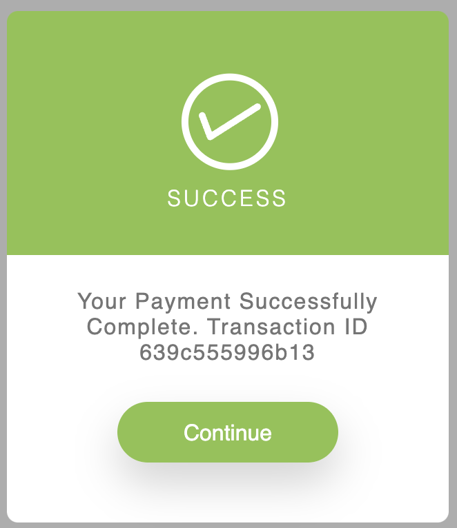
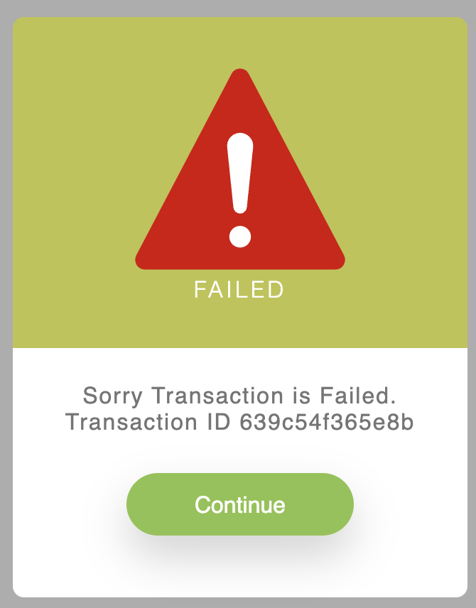

# Bkash Payment Gateway for PHP/Laravel Framework

[](https://packagist.org/packages/karim007/laravel-bkash-tokenize)
[](https://packagist.org/packages/karim007/laravel-bkash-tokenize)

## Features

This is a php/laravel wrapper package for [Bkash](https://developer.bka.sh/)

## Requirements

- PHP >=7.4
- Laravel >= 6


## Installation

```bash
composer require karim007/laravel-bkash-tokenize
```

## Examples




For  video tutorial click the image bellow or https://youtu.be/xue4EP5et58

[](https://youtu.be/pAbr1X0Jz6s)


### vendor publish (config)

```bash
php artisan vendor:publish --provider="Karim007\LaravelBkashTokenize\BkashTokenizeServiceProvider" --tag="config"

```

After publish config file setup your credential. you can see this in your config directory bkash.php file

```
"sandbox"         => env("BKASH_SANDBOX", true),

"bkash_app_key"     => env("BKASH_APP_KEY", ""),
"bkash_app_secret" => env("BKASH_APP_SECRET", ""),
"bkash_username"      => env("BKASH_USERNAME", ""),
"bkash_password"     => env("BKASH_PASSWORD", ""),

"bkash_app_key_2"     => env("BKASH_APP_KEY_2", ""),
"bkash_app_secret_2" => env("BKASH_APP_SECRET_2", ""),
"bkash_username_2"      => env("BKASH_USERNAME_2", ""),
"bkash_password_2"     => env("BKASH_PASSWORD_2", ""),

//so on ...

"callbackURL"     => env("BKASH_CALLBACK_URL", "http://127.0.0.1:8000/bkash/callback"),
'timezone'        => 'Asia/Dhaka', 
```

### Set .env configuration

```
BKASH_SANDBOX=true  #for production use false

BKASH_APP_KEY=""
BKASH_APP_SECRET=""
BKASH_USERNAME=""
BKASH_PASSWORD=""

#for multi account
BKASH_APP_KEY_2=""
BKASH_APP_SECRET_2=""
BKASH_USERNAME_2=""
BKASH_PASSWORD_2=""

#so on just use _number likes _3, _4, _5

BKASH_CALLBACK_URL=""
```

## Usage
### 1. publish a controller
```
php artisan vendor:publish --provider="Karim007\LaravelBkashTokenize\BkashTokenizeServiceProvider" --tag="controllers"

```

### 2. you can override the routes
```php
Route::group(['middleware' => ['web']], function () {
    // Payment Routes for bKash
    Route::get('/bkash/payment', [App\Http\Controllers\BkashTokenizePaymentController::class,'index']);
    Route::get('/bkash/create-payment', [App\Http\Controllers\BkashTokenizePaymentController::class,'createPayment'])->name('bkash-create-payment');
    Route::get('/bkash/callback', [App\Http\Controllers\BkashTokenizePaymentController::class,'callBack'])->name('bkash-callBack');

    //search payment
    Route::get('/bkash/search/{trxID}', [App\Http\Controllers\BkashTokenizePaymentController::class,'searchTnx'])->name('bkash-serach');

    //refund payment routes
    Route::get('/bkash/refund', [App\Http\Controllers\BkashTokenizePaymentController::class,'refund'])->name('bkash-refund');
    Route::get('/bkash/refund/status', [App\Http\Controllers\BkashTokenizePaymentController::class,'refundStatus'])->name('bkash-refund-status');

});
```

### 3. payment page
you will find it App\Http\Controllers\BkashTokenizePaymentController
```
public function index()
{
    return view('bkashT::bkash-payment');
}
```


### 4. create payment

```php
public function createPayment(Request $request)
    {
        $inv = uniqid();
        $request['intent'] = 'sale';
        $request['mode'] = '0011';
        $request['payerReference'] = $inv;
        $request['currency'] = 'BDT';
        $request['amount'] = 100;
        $request['merchantInvoiceNumber'] = $inv;
        $request['callbackURL'] = config("bkash.callbackURL");;

        $request_data_json = json_encode($request->all());

        $response =  BkashPaymentTokenize::cPayment($request_data_json);
        //$response =  BkashPaymentTokenize::cPayment($request_data_json,1); //last parameter is your account number for multi account its like, 1,2,3,4,cont.. default param is 1

        //store paymentID and your account number for matching in callback request
        // dd($response) //if you are using sandbox and not submit info to bkash use it for 1 response


        if (isset($response['bkashURL'])) return redirect()->away($response['bkashURL']);
        else return redirect()->back()->with('error-alert2', $response['statusMessage']);
    }

```
###create payment response
```array
array[
  "statusCode" => "0000"
  "statusMessage" => "Successful"
  "paymentID" => "Your payment id"
  "bkashURL" => "https://sandbox.payment.bkash.com/redirect/tokenized/?paymentID=your_payment_id&hash=your_hash"
  "callbackURL" => "base_url/bkash/callback"
  "successCallbackURL" => "base_url/bkash/callback?paymentID=your_payment_id&status=success"
  "failureCallbackURL" => "base_url/bkash/callback?paymentID=your_payment_id&status=failure"
  "cancelledCallbackURL" => "base_url/bkash/callback?paymentID=your_payment_id&status=cancel"
  "amount" => "100"
  "intent" => "sale"
  "currency" => "BDT"
  "paymentCreateTime" => "2023-01-23T02:16:57:784 GMT+0600"
  "transactionStatus" => "Initiated"
  "merchantInvoiceNumber" => "merchant_invoice_no"
]
```

### 5. callback function

```php
public function callBack(Request $request)
    {
        //callback request params
        // paymentID=your_payment_id&status=success&apiVersion=1.2.0-beta
        //using paymentID find the account number for sending params

        if ($request->status == 'success'){
            $response = BkashPaymentTokenize::executePayment($request->paymentID);
            //$response = BkashPaymentTokenize::executePayment($request->paymentID, 1); //last parameter is your account number for multi account its like, 1,2,3,4,cont..

            if (!$response){
                $response =  BkashPaymentTokenize::queryPayment($request->paymentID);
                //$response = BkashPaymentTokenize::queryPayment($request->paymentID,1); //last parameter is your account number for multi account its like, 1,2,3,4,cont..

            }
            if (isset($response['statusCode']) && $response['statusCode'] == "0000" && $response['transactionStatus'] == "Completed") {
                /*
                 * for refund need to store
                 * paymentID and trxID
                 * */
                return BkashPaymentTokenize::success('Thank you for your payment', $response['trxID']);
            }
            return BkashPaymentTokenize::failure($response['statusMessage']);
        }else if ($request->status == 'cancel'){
            return BkashPaymentTokenize::cancel('Your payment is canceled');
        }else{
            return BkashPaymentTokenize::failure('Your transaction is failed');
        }
    }
```
### 5. execute payment response
```json
{
   "statusCode":"0000",
   "statusMessage":"Successful",
   "paymentID":"your_payment_id",
   "payerReference":"your_ref_id",
   "customerMsisdn":"customer_msi",
   "trxID":"your_tnx_id",
   "amount":"100",
   "transactionStatus":"Completed",
   "paymentExecuteTime":"2023-01-23T02:04:05:736 GMT+0600",
   "currency":"BDT",
   "intent":"sale"
}
```

### 6. query payment response

```json
{
    "paymentID":"your_payment_id",
   "mode":"0011",
   "paymentCreateTime":"2023-01-23T02:01:06:713 GMT+0600",
   "paymentExecuteTime":"2023-01-23T02:04:05:736 GMT+0600",
   "amount":"100",
   "currency":"BDT",
   "intent":"sale",
   "merchantInvoice":"merchant_inv_no",
   "trxID":"tnx_no",
   "transactionStatus":"Completed",
   "verificationStatus":"Complete",
   "statusCode":"0000",
   "statusMessage":"Successful",
   "payerReference":"pay_ref"
}

```
### 7. search transaction

```php
public function searchTnx($trxID)
{
    //response
    /*{
        "trxID":"tnx_no",
       "initiationTime":"2023-01-23T12:06:05:000 GMT+0600",
       "completedTime":"2023-01-23T12:06:05:000 GMT+0600",
       "transactionType":"bKash Tokenized Checkout via API",
       "customerMsisdn":"customer_msi",
       "transactionStatus":"Completed",
       "amount":"20",
       "currency":"BDT",
       "organizationShortCode":"og_short_code",
       "statusCode":"0000",
       "statusMessage":"Successful"
    }*/
    return BkashPaymentTokenize::searchTransaction($trxID);
    //return BkashPaymentTokenize::searchTransaction($trxID,1); //last parameter is your account number for multi account its like, 1,2,3,4,cont..

}
```

### 8. refund transaction

```php
public function refund(Request $request)
    {
        $paymentID='paymentID';
        $trxID='trxID';
        $amount=5;
        $reason='this is test reason';
        $sku='abc';
        //response
        /*{
            "statusCode":"0000",
           "statusMessage":"Successful",
           "originalTrxID":"or_tnx_no",
           "refundTrxID":"refund_tnx",
           "transactionStatus":"Completed",
           "amount":"5",
           "currency":"BDT",
           "charge":"0.00",
           "completedTime":"2023-01-23T15:53:29:120 GMT+0600"
        }*/
        return BkashRefundTokenize::refund($paymentID,$trxID,$amount,$reason,$sku);
        //return BkashRefundTokenize::refund($paymentID,$trxID,$amount,$reason,$sku, 1); //last parameter is your account number for multi account its like, 1,2,3,4,cont..

    }
```
### 9. refund status check

```php
public function refundStatus(Request $request)
    {
        $paymentID='paymentID';
        $trxID='trxID';
        /*{
            "statusCode":"0000",
           "statusMessage":"Successful",
           "originalTrxID":"ori_tx",
           "refundTrxID":"ref_tx",
           "transactionStatus":"Completed",
           "amount":"5",
           "currency":"BDT",
           "charge":"0.00",
           "completedTime":"2023-01-23T15:53:29:120 GMT+0600"
        }*/
        return BkashRefundTokenize::refundStatus($paymentID,$trxID);
        //return BkashRefundTokenize::refundStatus($paymentID,$trxID, 1); //last parameter is your account number for multi account its like, 1,2,3,4,cont..

    }
```
N.B. If you are using single account dont need to think about account parameter ignore it just simply use as usal

#### Required APIs
0. **Developer Portal** (detail Product, workflow, API information): https://developer.bka.sh/docs/checkout-process-overview
1. **Grant Token :** https://developer.bka.sh/v1.2.0-beta/reference#gettokenusingpost
2. **Create Payment :** https://developer.bka.sh/v1.2.0-beta/reference#createpaymentusingpost
3. **Execute Payment :** https://developer.bka.sh/v1.2.0-beta/reference#executepaymentusingpost
4. **Query Payment :** https://developer.bka.sh/v1.2.0-beta/reference#querypaymentusingget
5. **Search Transaction Details :** https://developer.bka.sh/v1.2.0-beta/reference#searchtransactionusingget

### Checkout Demo
1. Go to https://merchantdemo.sandbox.bka.sh/frontend/checkout/version/1.2.0-beta
2. **Wallet Number:** 01877722345
3. **OTP:** 123456
4. **Pin:** 12121

Contributions to the Bkash Payment Gateway package are welcome. Please note the following guidelines before submitting your pull
request.

- Follow [PSR-4](http://www.php-fig.org/psr/psr-4/) coding standards.
- Read bkash API documentations first. Please contact with bkash for their api documentation and sandbox access.

## License

This repository is licensed under the [MIT License](http://opensource.org/licenses/MIT).

Copyright 2022 [md abdul karim](https://github.com/karim-007). We are not affiliated with bkash and don't give any guarantee. 
